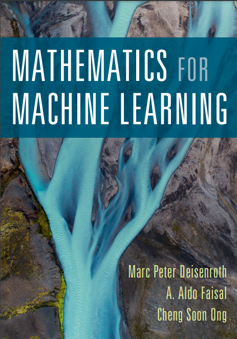

# Mathematics for Machine Learning

# Intro

> This is a repository of reviewing and studying Mathematics for Machine Learning.

**LicenseProvided under the terms of the CC BY-NC 4.0 License.**

**Copyright © 2023 [MaximHelio](mailto:maximilhac@gmail.com).**

# Index

- Linear Algebra
- Matrix decompositions
- Probability and distributions
- Estimation and Information
- Optimization

